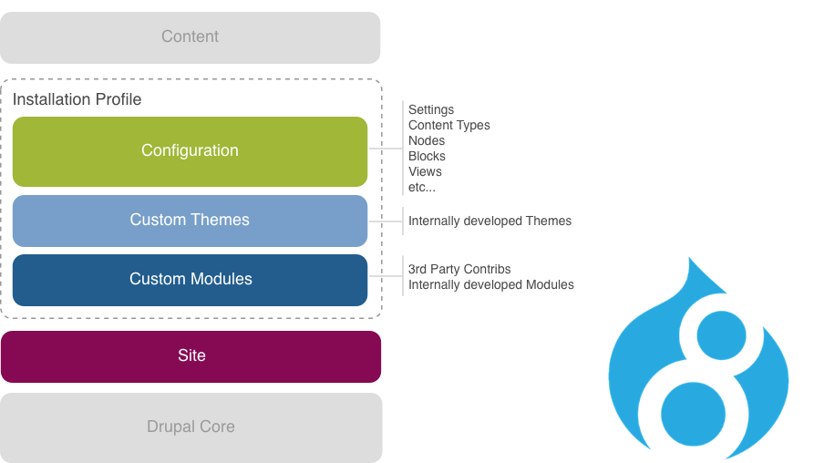

# Digital App Code and Configuration

This folder contains the source code for custom modules, themes, configuration, profile and site settings.

> Files within this folder structure are 'compiled' and placed within the 'web' folder  - where the 'executed' Drupal site is located.

## Overview

The 'Drupal Core' code (located outside of this folder at ../core/) is part of the standard release of Drupal and should not be changed. It provides fundamental web content management features for building websites through its included "core modules" and "core themes".

To add additional features or customization you can select from thousands of free, community-contributed modules known as 'contrib modules' or develop your own 'custom modules'.

The appearance of a Drupal website is controlled by a theme. In addition to the pre-installed core themes, you can select from many free pre-built contrib themes contributed by the Drupal community, or develop your own 'custom themes'.
 
The configuration of various Drupal components, everything from the list of enabled modules, through to content types, taxonomy vocabularies, fields, and views.

> All content is stored within the Drupal Database.

## Custom folders

### config
While the configuration of a Drupal site is stored within the Drupal database it's recommended that you 'export' the configuration into .yml files and store them within this folder.

> Please review the scripts folder as this Digital App provides a number of useful import and export commands.

A high-level overview of the configuration changes made for this Digital App can be found [here](config/README.md).

### themes
Internally developed 'custom themes' should be added to this folder.

> You will need to ensure all SASS files are correctly 'compiled' using an appropriate `dev_workflow` or Grunt script.

Further detail on any internally developed 'custom themes' can be found [here](themes/README.md).

### modules
3rd party 'contrib modules' and internally developed 'custom modules' should be added to this folder.

> 3rd party modules installed by composer will not appear in this folder, as they are downloaded at point of install and added directly to the /web/ folder.

Further detail on any internally developed 'custom modules' or installed 3rd party 'contrib modules' can be found [here](themes/README.md).

### sites
General site/server settings are placed here, such as domain names, debug settings, cache settings, etc.

> Site specific custom modules and custom themes can also be added below this folder, however as Digital Apps are generally for one site only we keep these in the standard custom module and custom theme folders.

A high-level overview of the site changes made for this Digital App can be found [here](sites/README.md).

### profiles
Installation profiles allow site settings, custom modules, custom themes and configuration to be packaged together, creating cleaner and easier way for whole Drupal sites to be installed.

> As Digital Apps are generally for one site only this feature is not generally used.
