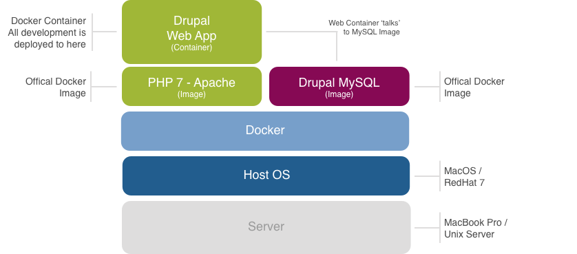

# The Docker Container

This folder contains a number of setting files used to configure the Docker container.

> Making changes to the files within this folder will only take affect when the Docker container is either installed or updated. 

## Overview

It's highly recommended that you have at least a basic understanding of Docker before attempting to change anything within this folder. Please visit [https://docs.docker.com](https://docs.docker.com) for more information on Docker and how it works.

In addition to the main Docker container, where all of the web code and configuration files is store, it also interacts with the MySQL image, which Drupal uses as it's main database. As this database is **not persistent** so its recommended that you export all site configuration into .yml files.

The steps to build the Drupal Web Container is documented in the [Dockerfile](../Dockerfile).

While the [docker-compose.yml](../docker-compose.yml) and the [docker-compose-dev.yml](../docker-compose-dev.yml) files outline what images, containers and volumes Docker needs to be build.

## Key Configuration Files

### php.ini
The `php.ini` file is the default configuration file for running applications that require PHP. It is used to control variables such as upload sizes, file timeouts, and resource limits.

### default.conf
`default.conf` is the configuration file for the Apache 2 server.

### rsyslog.conf
`rsyslog.conf` is the configuration file for Rsyslog, an open-source software utility used on UNIX and Unix-like computer systems for forwarding log messages in an IP network.

### supervisord.conf
`supervisord.conf`is the configuration file for Supervisor, a client/server system that allows its users to monitor and control a number of processes on UNIX-like operating systems. It shares some of the same goals of programs like launchd, daemontools, and runit.

### xdebug.ini
`xdebug.ini`is the configuration file for Xdebug, a PHP extension which provides debugging and profiling capabilities.

### opcache.ini
`opcache.ini`is used by OpCache. As each PHP script is being compiled at runtime, a part of the execution time gets used for transforming the human readable code into code that can be understood by the machine. A bytecode cache engine like OpCache, APC or Xcache does it only once – during the first execution of a specific PHP file.

### drushrc.php
`drushrc.php`is the configuration file for Drush - The command line shell and Unix scripting interface for Drupal.
